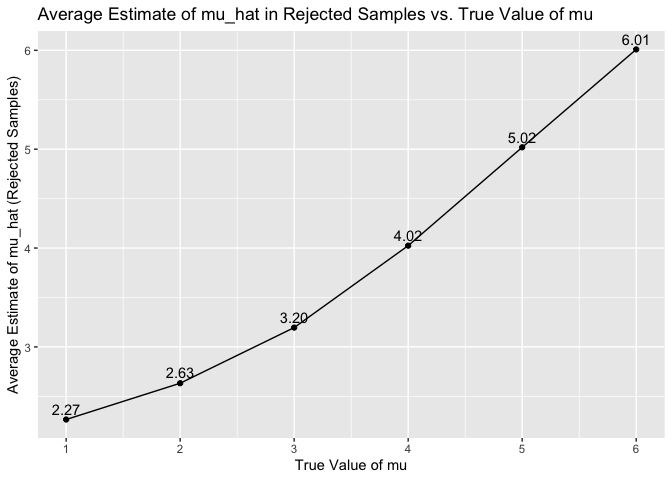

p8105_hw5_lz2949
================
Longyi Zhao
2023-11-03

``` r
library(tidyverse)
```

    ## ── Attaching core tidyverse packages ──────────────────────── tidyverse 2.0.0 ──
    ## ✔ dplyr     1.1.3     ✔ readr     2.1.4
    ## ✔ forcats   1.0.0     ✔ stringr   1.5.0
    ## ✔ ggplot2   3.4.3     ✔ tibble    3.2.1
    ## ✔ lubridate 1.9.2     ✔ tidyr     1.3.0
    ## ✔ purrr     1.0.2     
    ## ── Conflicts ────────────────────────────────────────── tidyverse_conflicts() ──
    ## ✖ dplyr::filter() masks stats::filter()
    ## ✖ dplyr::lag()    masks stats::lag()
    ## ℹ Use the conflicted package (<http://conflicted.r-lib.org/>) to force all conflicts to become errors

``` r
library(broom)
library(ggplot2)
```

## Problem 1

``` r
homi_data = read_csv(file = "./data/homicide-data.csv")
```

    ## Rows: 52179 Columns: 12
    ## ── Column specification ────────────────────────────────────────────────────────
    ## Delimiter: ","
    ## chr (9): uid, victim_last, victim_first, victim_race, victim_age, victim_sex...
    ## dbl (3): reported_date, lat, lon
    ## 
    ## ℹ Use `spec()` to retrieve the full column specification for this data.
    ## ℹ Specify the column types or set `show_col_types = FALSE` to quiet this message.

``` r
# Create a city_state variable
homi_data  = 
  homi_data |>
  mutate(city_state = paste(city,state,sep = ", "))

# summary and count number of homicides 
summary_data = homi_data |>
  group_by(city_state) |>
  summarise(
    homi_solved = sum(disposition == 'Closed by arrest'),
    homi_unsolved = sum(disposition == 'Open/No arrest' | disposition == 'Closed without arrest')
  )
```

Description:

``` r
# in 'Baltimore, MD' estimate the proportion of homicides that are unsolved. 
balt_md = summary_data |>
  filter(city_state == "Baltimore, MD") |>
  mutate(sum_homi = sum(homi_solved, homi_unsolved)) |>
  do ({prop.test(.$homi_unsolved, .$sum_homi) |>
  broom::tidy() })|>
  select(estimate, conf.low, conf.high) |>
  mutate(city_state = "Baltimore, MD") 
```

``` r
# run prop.test for each of the city
result_df <- summary_data |>
  group_by(city_state) |>
  summarize(prop_test_results = map(homi_unsolved, ~ prop.test(.x, .x +homi_solved) |>
  broom::tidy())) |>
  unnest(prop_test_results) |>
  select(city_state, estimate, conf.low, conf.high) 
```

    ## Warning: There was 1 warning in `summarize()`.
    ## ℹ In argument: `prop_test_results = map(homi_unsolved,
    ##   ~broom::tidy(prop.test(.x, .x + homi_solved)))`.
    ## ℹ In group 49: `city_state = "Tulsa, AL"`.
    ## Caused by warning in `prop.test()`:
    ## ! Chi-squared approximation may be incorrect

``` r
print(result_df)
```

    ## # A tibble: 51 × 4
    ##    city_state      estimate conf.low conf.high
    ##    <chr>              <dbl>    <dbl>     <dbl>
    ##  1 Albuquerque, NM    0.386    0.337     0.438
    ##  2 Atlanta, GA        0.383    0.353     0.415
    ##  3 Baltimore, MD      0.646    0.628     0.663
    ##  4 Baton Rouge, LA    0.462    0.414     0.511
    ##  5 Birmingham, AL     0.434    0.399     0.469
    ##  6 Boston, MA         0.505    0.465     0.545
    ##  7 Buffalo, NY        0.612    0.569     0.654
    ##  8 Charlotte, NC      0.300    0.266     0.336
    ##  9 Chicago, IL        0.736    0.724     0.747
    ## 10 Cincinnati, OH     0.445    0.408     0.483
    ## # ℹ 41 more rows

``` r
ggplot(result_df, aes(x = city_state, 
                      y = estimate, 
                      color = city_state
                      )) +
  geom_point(size = 2) +
  geom_errorbar(aes(ymin = conf.low, ymax = conf.high), width = 0.2) +
  labs(
    title = "Estimated Proportions and Confidence Intervals by City",
    x = "City",
    y = "Estimated Proportion of Unsolved Homicides"
  ) +
  theme(axis.text.x = element_text(angle = 60, hjust = 1)) +
  theme(legend.position = "none")
```

<!-- -->

``` r
# drop legend?
```

description

## Problem 2

``` r
# a dataframe containign all file names
data_directory = "./datap2"
file_names = list.files(path = data_directory, full.names = TRUE, pattern = ".csv")

# iterate over file names and read in data for each subject using map and save rthe result
data_list = map(file_names, ~ read.csv(.x) |>
                  mutate(subject_id = basename(.x)) |>
                  separate(subject_id, c("subject_id", "arm"), sep = "_"))

# tidy the result
tidy_data = bind_rows(data_list) |>
  rename(test_arm = subject_id, test_id = arm) |>
  mutate(test_id = sub( "\\.csv$", "", test_id)) |>
  pivot_longer(cols = starts_with("week_"), names_to = "time", values_to = "value")
```

``` r
# make a spaghetti plot showing observations on each subject over time
ggplot(tidy_data, 
       aes(x = time, y = value, group = test_id, color = test_id)) +
  geom_point() +
  geom_line() +
  facet_wrap(.~test_arm) +
  labs(
    title = "Spaghetti Plot of Observations Over Time",
    x = "Time",
    y = "Value",
    color = "Subject ID"
  ) +
  theme(axis.text.x = element_text(angle = 60, hjust = 1))
```

<!-- -->
Description: In the control group, though each participant has some
fluctuations in 8 weeks, values are generally stable, no clear trend of
increasing or decreasing. The average value of 10 participants in
control group at week 1 is 0.915; the average value of 10 participants
in control group at week 8 is 0.74. In the experiment group, there is a
clear increasing trend as time passed: at week 1, the average value is
1.141; at week 8, the average value is 5.119.

## Problem 3

Conduct a simulation to explore power in a one-sample t-test

``` r
# fix two design elements
# alpha = 0.95
# H0, true mean is equal to 0 
n = 30
sigma = 5
set.seed(12345)

# set mu = 0 and generate 5000 datasets from the model x~norm(mu, sigma)
mu = 0

output = vector("list", length= 5000)

for (i in 1:5000) {
  sample_data = rnorm(n, mean = mu, sd = sigma)
  output[[i]] = t.test(sample_data, mu = 0) |>
    broom::tidy()
}

sim_results = output |>
  bind_rows() |>
  select(estimate, p.value) |>
  mutate(mu = 0) 
```

``` r
# repeat the result for mu = {1,2,3,4,5,6}
simulate_mu = function(mu) {
  output_onesix = vector("list", length = 5000)

  for (i in 1:5000) {
    sample_data_onesix = rnorm(n, mean = mu, sd = sigma)
    output_onesix[[i]] = t.test(sample_data_onesix, mu = 0) |> 
      broom::tidy()
  }

  sim_results_onesix = output_onesix |> 
    bind_rows() |> 
    select(estimate, p.value) |>
    mutate(mu = mu)
  return(sim_results_onesix)
}

mu_onesix = c(1,2,3,4,5,6)
results_onesix = map(mu_onesix, simulate_mu) |>
  bind_rows() 
```

Make a plot showing the proportion of times the null was rejected on the
y axis and true value of mu on the x axis

``` r
reject_data = results_onesix |>
  group_by (mu) |>
  mutate(rejected = p.value <0.05) |>
  summarize(proportion_rejected = sum(rejected)/n())

ggplot(reject_data, aes (x = mu, y = proportion_rejected)) +
  geom_line() +
  geom_point() +
  labs(
    x = "True Value of mu",
    y = "Proportion of Rejections (Power)",
    title = "Power vs. True Value of mu"
  ) 
```

<!-- -->
Description: From the plot, when mu increase, the proportion of
rejection(power) increases. When mu is 5 and 6, the power is almost 1.
Statistically speaking, larger effect size would lead to higher power
because larger effect size means the differences between groups are
bigger, easier to detect, leading to higher rejection rate.

Make a plot showing the average estimate of mu_hat on the y axis and
true value of mu on the x axis

``` r
average_mu = results_onesix |>
  group_by(mu) |>
  summarize(average_mu_hat = mean(estimate))

ggplot (average_mu, aes(x = mu, y = average_mu_hat)) +
  geom_line() +
  geom_point() +
  labs(
    x = "True Value of mu",
    y = "Average Estimate of mu_hat",
    title = "Average Estimate of mu_hat vs. True Value of mu") +
  scale_x_continuous(breaks = seq(0, 6, by = 1)) +
  scale_y_continuous(breaks = seq(0, 6, by = 1)) +
  geom_text(aes(label = sprintf("%.2f", average_mu_hat)), vjust = -0.5)
```

<!-- -->

``` r
# text label the average estimate of mu hat
```

Make a plot on showing the average estimate of mu_hat only in samples
for which the null was rejected on the y axis and the true value of mu
on the x axis.

``` r
average_reject = results_onesix |>
  group_by(mu) |>
  filter(p.value <0.05) |>
  summarize (average_mu_rej = mean(estimate)) 

ggplot(average_reject, aes(x = mu, y = average_mu_rej)) +
  geom_line() +
  geom_point() +
  labs(
    x = "True Value of mu",
    y = "Average Estimate of mu_hat (Rejected Samples)",
    title = "Average Estimate of mu_hat in Rejected Samples vs. True Value of mu") +
  scale_x_continuous(breaks = seq(0, 6, by = 1)) +
  scale_y_continuous(breaks = seq(0, 6, by = 1)) +
  geom_text(aes(label = sprintf("%.2f", average_mu_rej)), vjust = -0.5)
```

<!-- -->
Description: From the second plot, the average value of mu_hat is very
close to the true value of mu. For example, when the true value of mu is
1, the avergae mu_hat is 1.01; when the true value is 5, the average
mu_hat is 5.02. In the third plot, at larger mu values (4,5,6), the
average estimated mu_hat values are very close to true values. However,
at smaller mu values, the deviation is larger. For example, when the
true mu value is 1, the average estimated mu_hat is 2.27; when true mu
value is 3, the average estimated mu_hat is 3.20.

When the null is rejected, it means there is evidence suggest that true
mu is different from tested value. So plot 3’s values are not
approximately equal.
